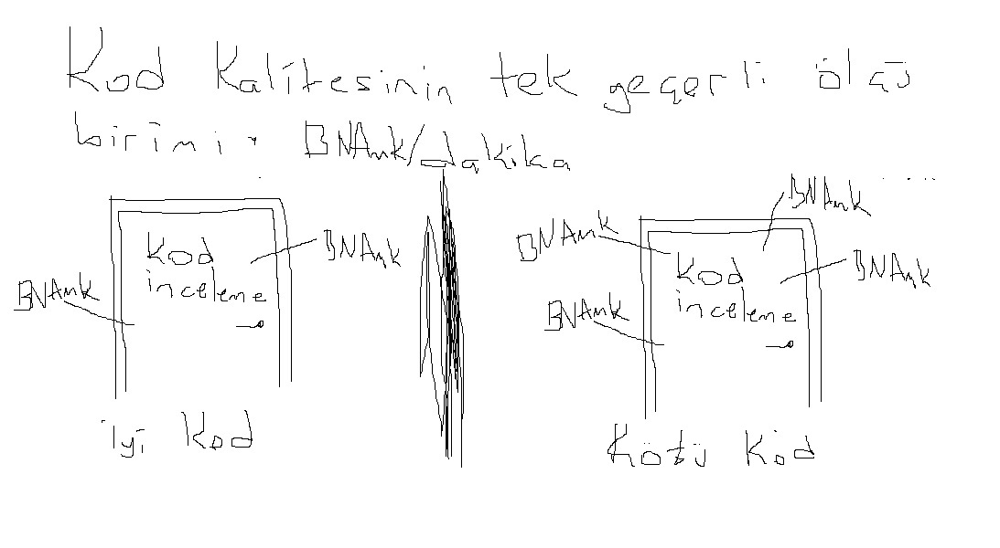

# clean-code-typescript [](https://twitter.com/intent/tweet?text=Clean%20Code%20Typescript&url=https://github.com/labs42io/clean-code-typescript)

TypeScript için uyarlanmış Temiz Kod kavramları.  
[clean-code-javascript](https://github.com/ryanmcdermott/clean-code-javascript) reposundan esinlenildi.

## içindekiler

  1. [Giriş](#giriş)
  2. [Değişkenler](#degişkenler)
  3. [Foksiyonlar](#fonksiyonlar)
  4. [Nesneler ve Veri Yapıları](#nesneler-ve-veri-yapıları)
  5. [Sınıflar](#sınıflar)
  6. [SOLID](#solid)
  7. [Test Etme](#test)
  8. [Eşzamanlılık](#eşzamanlılık)
  9. [Hata yönetimi](#hata-yönetimi)
  10. [Biçimlendirme](#biçimlendirme)
  11. [Yorumlar](#yorumlar)
  12. [Çeviriler](#çeviriler)

## Giriş



Robert C. Martin'in [*Clean Code*](https://www.amazon.com/Clean-Code-Handbook-Software-Craftsmanship/dp/0132350882) kitabından Yazılım mühendisliği ilkeleri TypeScript için uyarlanmıştır. Resmi bir rehber değildir.
Typescript ile [okunabilir, tekrar kullanılabilir, and düzenlenebilir](https://github.com/ryanmcdermott/3rs-of-software-architecture) yazılımlar üretimek için hazırlanmış bir rehberdir.


Buradaki her ilkeye katı bir şekilde uyulması gerekmez ve hatta daha azı evrensel olarak üzerinde anlaşmaya varılacaktır. Bunlar yönergelerdir ve başka bir şey değildir, ancak *Temiz Kod* yazarlarının uzun yıllara dayanan toplu deneyimleriyle kodlanmış olanlardır..

Yazılım mühendisliği zanaatımız 50 yaşın biraz üzerinde ve hala çok şey öğreniyoruz. Yazılım mimarisi, mimarinin kendisi kadar eski olduğunda, belki o zaman uyması gereken daha zor kurallarımız olacaktır. Şimdilik, bu yönergelerin sizin ve ekibinizin ürettiği TypeScript kodunun kalitesini değerlendirmek için bir mihenk taşı görevi görmesine izin verin.

Bir şey daha: Bunları bilmek sizi hemen daha iyi bir yazılım geliştirici yapmaz ve onlarla uzun yıllar çalışmak hata yapmayacağınız anlamına gelmez. Her kod parçası, ıslak kilin son şeklini alması gibi bir ilk taslak olarak başlar. Son olarak, akranlarımızla gözden geçirdiğimizde kusurları ortadan kaldırırız. İyileştirilmesi gereken ilk taslaklar için kendinizi hırpalamayın. Bunun yerine kodu pataklayın!

**[⬆ en yukarı](#içindekiler)**

## Degişkenler

### Anlamlı değişken isimleri kullanın

İsimleri, okuyucunun farklılıkların neler sunduğunu bileceği şekilde ayırt edilecek şekilde verin.

**Kötü:**

```ts
function between<T>(a1: T, a2: T, a3: T): boolean {
  return a2 <= a1 && a1 <= a3;
}

```

**İyi:**

```ts
function between<T>(value: T, left: T, right: T): boolean {
  return left <= value && value <= right;
}
```

**[⬆ en yukarı](#içindekiler)**

### Telaffuz edilebilir değişken adları kullanın

Telaffuz edemiyorsanız, aptal gibi konuşmadan tartışamazsınız.

**Kötü:**

```ts
type DtaRcrd102 = {
  genymdhms: Date;
  modymdhms: Date;
  pszqint: number;
}
```

**İyi:**

```ts
type Customer = {
  generationTimestamp: Date;
  modificationTimestamp: Date;
  recordId: number;
}
```

**[⬆ en yukarı](#içindekiler)**

### Aynı değişken türü için aynı kelime dağarcığını kullanın

**Kötü:**

```ts
function getUserInfo(): User;
function getUserDetails(): User;
function getUserData(): User;
```

**İyi:**

```ts
function getUser(): User;
```

**[⬆ en yukarı](#içindekiler)**

### Aranabilir isimler kullanın


Yazacağımızdan daha fazla kod okuyacağız. Yazdığımız kodun okunabilir ve aranabilir olması önemlidir. Programımızı anlamak için anlamlı hale gelen değişkenleri * adlandırmayarak * okuyucularımızı incitiyoruz. İsimlerinizi aranabilir yapın. [ESLint](https://typescript-eslint.io/) gibi araçlar, isimsiz sabitleri belirlemeye yardımcı olabilir.


**Kötü:**

```ts
// 86400000 ne elma mı armut mu
setTimeout(restart, 86400000);
```

**İyi:**

```ts
// Bunları büyük harfle adlandırılmış sabitler olarak bildirin.
const MILLISECONDS_PER_DAY = 24 * 60 * 60 * 1000; // 86400000

setTimeout(restart, MILLISECONDS_PER_DAY);
```

**[⬆ en yukarı](#içindekiler)**

### Açıklayıcı değişkenler kullanın

**Kötü:**

```ts
declare const users: Map<string, User>;

for (const keyValue of users) {
  // kullanıcı sözlüğünde her bir eleman için ilerler
}
```

**İyi:**

```ts
declare const users: Map<string, User>;

for (const [id, user] of users) {
  // kullanıcı sözlüğünde her bir eleman için ilerler
}
```

**[⬆ en yukarı](#içindekiler)**

### Zihinsel Haritalamadan Kaçının

Açıklık, kapalı olmaktan daha iyidir. 
*Netlik kraldır.*

**Kötü:**

```ts
const u = getUser();
const s = getSubscription();
const t = charge(u, s);
```

**İyi:**

```ts
const user = getUser();
const subscription = getSubscription();
const transaction = charge(user, subscription);
```

**[⬆ en yukarı](#içindekiler)**

### Gereksiz bağlam eklemeyin

Sınıf/tür/nesne adınız size bir şey söylüyorsa, bunu değişken adınızda tekrarlamayın.

**Kötü:**

```ts
type Car = {
  carMake: string;
  carModel: string;
  carColor: string;
}

function print(car: Car): void {
  console.log(`${car.carMake} ${car.carModel} (${car.carColor})`);
}
```

**İyi:**

```ts
type Car = {
  make: string;
  model: string;
  color: string;
}

function print(car: Car): void {
  console.log(`${car.make} ${car.model} (${car.color})`);
}
```

**[⬆ en yukarı](#içindekiler)**

### Kısaltmalardan veya koşullu ifadeler yerine varsayılan bağımsız değişkenleri kullanın

Varsayılan bağımsız değişkenler genellikle kısaltmalardan daha temizdir.

**Kötü:**

```ts
function loadPages(count?: number) {
  const loadCount = count !== undefined ? count : 10;
  // ...
}
```

**İyi:**

```ts
function loadPages(count: number = 10) {
  // ...
}
```

**[⬆ en yukarı](#içindekiler)**

### Dokümanın amacını anlatmak için enum kullanın

Enum, kodun amacını belgelemenize yardımcı olabilir. Örneğin, değerlerin tam değerinden ziyade farklı olmasıyla ilgili endişelendiğimizde.

**Kötü:**

```ts
const GENRE = {
  ROMANTIC: 'romantic',
  DRAMA: 'drama',
  COMEDY: 'comedy',
  DOCUMENTARY: 'documentary',
}

projector.configureFilm(GENRE.COMEDY);

class Projector {
  // declaration of Projector
  configureFilm(genre) {
    switch (genre) {
      case GENRE.ROMANTIC:
        // some logic to be executed 
    }
  }
}
```

**İyi:**

```ts
enum GENRE {
  ROMANTIC,
  DRAMA,
  COMEDY,
  DOCUMENTARY,
}

projector.configureFilm(GENRE.COMEDY);

class Projector {
  // declaration of Projector
  configureFilm(genre) {
    switch (genre) {
      case GENRE.ROMANTIC:
        // some logic to be executed 
    }
  }
}
```

**[⬆ en yukarı](#içindekiler)**

## Fonksiyonlar

### Fonksiyon argümanları 2 ve ya daha az olmalı

Fonksiyon parametrelerinin sayısını sınırlamak, fonksiyonu test etmeyi kolaylaştırdığından inanılmaz derecede önemlidir.
Üçten fazlasına sahip olmak, her bir ayrı argümanla tonlarca farklı durumu test etmeniz gereken bir kombinasyonel patlamaya yol açar.  

Bir veya iki argüman ideal durumdur ve mümkünse üçünden kaçınılmalıdır. Bundan daha fazlası konsolide edilmelidir.
Genellikle, ikiden fazla argümanınız varsa, fonksiyonunuz çok fazla şey yapmaya çalışıyor demektir.
Olmadığı durumlarda, çoğu zaman daha yüksek seviyeli bir nesne argüman olarak yeterli olacaktır.

Çok fazla argümana ihtiyaç duyuyorsanız, nesne değişmezlerini kullanmayı düşünün.  

Fonksiyonun hangi özellikleri beklediğini açıkça belirtmek için, [yapıyı bozan](https://basarat.gitbook.io/typescript/future-javascript/destructuring)  sözdizimini kullanabilirsiniz.

Bunun birkaç avantajı vardır:

1. Birisi fonksiyon imzasına baktığında, hangi özelliklerin kullanıldığı hemen anlaşılır.

2. Adlandırılmış parametreleri simüle etmek için kullanılabilir.

3. Yıkım, fonksiyona iletilen bağımsız değişken nesnesinin belirtilen ilkel değerlerini de klonlar. Bu, yan etkileri önlemeye yardımcı olabilir. Not: argüman nesnesinden alınan yıkılmış nesneler ve diziler klonlanMAZ.

4. TypeScript, sizi kullanılmayan özellikler hakkında uyarır, bu da yapıyı bozmadan imkansız olur.

**Kötü:**

```ts
function createMenu(title: string, body: string, buttonText: string, cancellable: boolean) {
  // ...
}

createMenu('Foo', 'Bar', 'Baz', true);
```

**İyi:**

```ts
function createMenu(options: { title: string, body: string, buttonText: string, cancellable: boolean }) {
  // ...
}

createMenu({
  title: 'Foo',
  body: 'Bar',
  buttonText: 'Baz',
  cancellable: true
});
```

[tür takma adları](https://www.typescriptlang.org/docs/handbook/advanced-types.html#type-aliases) kullanarak okunabilirliği daha da artırabilirsiniz:

```ts

type MenuOptions = { title: string, body: string, buttonText: string, cancellable: boolean };

function createMenu(options: MenuOptions) {
  // ...
}

createMenu({
  title: 'Foo',
  body: 'Bar',
  buttonText: 'Baz',
  cancellable: true
});
```

**[⬆ en yukarı](#içindekiler)**

### Fonksyionlar tek bir iş yapmalıdır

Bu, yazılım mühendisliğinin açık ara en önemli kuralıdır. Fonksiyonlar birden fazla şey yaptığında bunları oluşturmak, test etmek ve akıl yürütmek daha zordur. Bir fonksiyonu tek bir eyleme ayırabildiğinizde, kolayca yeniden düzenlenebilir ve kodunuz çok daha temiz okunur. Bu kılavuzdan bunun dışında hiçbir şey çıkarmazsanı dahi birçok geliştiriciden önde olursunuz.

**Kötü:**

```ts
function emailActiveClients(clients: Client[]) {
  clients.forEach((client) => {
    const clientRecord = database.lookup(client);
    if (clientRecord.isActive()) {
      email(client);
    }
  });
}
```

**İyi:**

```ts
function emailActiveClients(clients: Client[]) {
  clients.filter(isActiveClient).forEach(email);
}

function isActiveClient(client: Client) {
  const clientRecord = database.lookup(client);
  return clientRecord.isActive();
}
```

**[⬆ en yukarı](#içindekiler)**

### Fonksiyon adları ne yaptıklarını söylemelidir

**Kötü:**

```ts
function addToDate(date: Date, month: number): Date {
  // ...
}

const date = new Date();

// It's hard to tell from the function name what is added
addToDate(date, 1);
```

**İyi:**

```ts
function addMonthToDate(date: Date, month: number): Date {
  // ...
}

const date = new Date();
addMonthToDate(date, 1);
```

**[⬆ en yukarı](#içindekiler)**

### Fonksiyonlar yalnızca bir soyutlama düzeyi olmalıdır

Birden fazla soyutlama seviyeniz olduğunda, fonksiyonunuz genellikle çok fazla şey yapıyor. Fonksiyonları bölmek, yeniden kullanılabilirliğe ve daha kolay testlere yol açar.

**Kötü:**

```ts
function parseCode(code: string) {
  const REGEXES = [ /* ... */ ];
  const statements = code.split(' ');
  const tokens = [];

  REGEXES.forEach((regex) => {
    statements.forEach((statement) => {
      // ...
    });
  });

  const ast = [];
  tokens.forEach((token) => {
    // lex...
  });

  ast.forEach((node) => {
    // parse...
  });
}
```

**İyi:**

```ts
const REGEXES = [ /* ... */ ];

function parseCode(code: string) {
  const tokens = tokenize(code);
  const syntaxTree = parse(tokens);

  syntaxTree.forEach((node) => {
    // parse...
  });
}

function tokenize(code: string): Token[] {
  const statements = code.split(' ');
  const tokens: Token[] = [];

  REGEXES.forEach((regex) => {
    statements.forEach((statement) => {
      tokens.push( /* ... */ );
    });
  });

  return tokens;
}

function parse(tokens: Token[]): SyntaxTree {
  const syntaxTree: SyntaxTree[] = [];
  tokens.forEach((token) => {
    syntaxTree.push( /* ... */ );
  });

  return syntaxTree;
}
```

**[⬆ en yukarı](#içindekiler)**

### Yinelenen kodu kaldır

Yinelenen koddan kaçınmak için elinizden gelenin en iyisini yapın.
Yinelenen kod kötüdür, çünkü bazı mantığı değiştirmeniz gerekirse, bir şeyi değiştirmek için birden fazla yer olduğu anlamına gelir.

Bir restoran işlettiğinizi ve envanterinizin kaydını tuttuğunuzu hayal edin: tüm domatesleriniz, soğanlarınız, sarımsaklarınız, baharatlarınız vs.
Bunu tuttuğunuz birden fazla listeniz varsa, içinde domates bulunan bir yemek servis ettiğinizde hepsinin güncellenmesi gerekir.
Yalnızca bir listeniz varsa, güncellenecek tek bir yer vardır!

Çoğu zaman yinelenen kodunuz olur çünkü birçok ortak noktayı paylaşan iki veya daha fazla farklı şeye sahipsiniz, ancak farklılıkları sizi aynı şeylerin çoğunu yapan iki veya daha fazla ayrı işleve sahip olmaya zorlar. Yinelenen kodu kaldırmak, yalnızca bir işlev/modül/sınıf ile bu farklı şeyler kümesini işleyebilecek bir soyutlama oluşturmak anlamına gelir.

Soyutlamayı doğru yapmak çok önemlidir, bu yüzden [SOLID](#solid) ilkelerini izlemelisiniz.Kötü soyutlamalar, yinelenen koddan daha kötü olabilir, bu yüzden dikkatli olun! Bunu söyledikten sonra, eğer iyi bir soyutlama yapabilirsen yap! Kendinizi tekrar etmeyin, aksi takdirde, bir şeyi değiştirmek istediğinizde kendinizi birden fazla yeri güncellerken bulacaksınız.

**Kötü:**

```ts
function showDeveloperList(developers: Developer[]) {
  developers.forEach((developer) => {
    const expectedSalary = developer.calculateExpectedSalary();
    const experience = developer.getExperience();
    const githubLink = developer.getGithubLink();

    const data = {
      expectedSalary,
      experience,
      githubLink
    };

    render(data);
  });
}

function showManagerList(managers: Manager[]) {
  managers.forEach((manager) => {
    const expectedSalary = manager.calculateExpectedSalary();
    const experience = manager.getExperience();
    const portfolio = manager.getMBAProjects();

    const data = {
      expectedSalary,
      experience,
      portfolio
    };

    render(data);
  });
}
```

**İyi:**

```ts
class Developer {
  // ...
  getExtraDetails() {
    return {
      githubLink: this.githubLink,
    }
  }
}

class Manager {
  // ...
  getExtraDetails() {
    return {
      portfolio: this.portfolio,
    }
  }
}

function showEmployeeList(employee: (Developer | Manager)[]) {
  employee.forEach((employee) => {
    const expectedSalary = employee.calculateExpectedSalary();
    const experience = employee.getExperience();
    const extra = employee.getExtraDetails();

    const data = {
      expectedSalary,
      experience,
      extra,
    };

    render(data);
  });
}
```

Soyutlamanıza uygunsa bir birleşim türü veya ortak üst sınıf eklemeyi de düşünebilirsiniz.
```ts
class Developer {
  // ...
}

class Manager {
  // ...
}

type Employee = Developer | Manager

function showEmployeeList(employee: Employee[]) {
  // ...
  });
}

```

Kod çoğaltma konusunda dikkatli olmalısınız. Bazen, gereksiz soyutlama getirerek, yinelenen kod ile artan karmaşıklık arasında bir denge vardır. İki farklı modülden iki uygulama benzer göründüğünde ancak farklı etki alanlarında yaşadığında, çoğaltma kabul edilebilir ve ortak kodu ayıklamak yerine tercih edilebilir. Ayıklanan ortak kod, bu durumda, iki modül arasında dolaylı bir bağımlılık getirir.

**[⬆ en yukarı](#içindekiler)**

### Object.assign veya yok etme ile varsayılan nesneleri ayarlayın

**Kötü:**

```ts
type MenuConfig = { title?: string, body?: string, buttonText?: string, cancellable?: boolean };

function createMenu(config: MenuConfig) {
  config.title = config.title || 'Foo';
  config.body = config.body || 'Bar';
  config.buttonText = config.buttonText || 'Baz';
  config.cancellable = config.cancellable !== undefined ? config.cancellable : true;

  // ...
}

createMenu({ body: 'Bar' });
```

**İyi:**

```ts
type MenuConfig = { title?: string, body?: string, buttonText?: string, cancellable?: boolean };

function createMenu(config: MenuConfig) {
  const menuConfig = Object.assign({
    title: 'Foo',
    body: 'Bar',
    buttonText: 'Baz',
    cancellable: true
  }, config);

  // ...
}

createMenu({ body: 'Bar' });
```

Ya da 3 nokta operatörünü kullanabilirsiniz:

```ts
function createMenu(config: MenuConfig) {
  const menuConfig = {
    title: 'Foo',
    body: 'Bar',
    buttonText: 'Baz',
    cancellable: true,
    ...config,
  };

  // ...
}
```
3 nokta operatörü ve `Object.assign()` çok benzerdir.
Ana farklılık 3 nokta yeni özellikler tanımlarken `Object.assign()` ise olanları belirler. Daha fazla açıklamayı [buradan](https://stackoverflow.com/questions/32925460/object-spread-vs-object-assign)) bulabilirsiniz

Alternatif olarak, yok etmeyi varsayılan değerlerle kullanabilirsiniz:

```ts
type MenuConfig = { title?: string, body?: string, buttonText?: string, cancellable?: boolean };

function createMenu({ title = 'Foo', body = 'Bar', buttonText = 'Baz', cancellable = true }: MenuConfig) {
  // ...
}

createMenu({ body: 'Bar' });
```

Açıkça `undefined` veya `null` değerini ileterek herhangi bir yan etkiden ve beklenmeyen davranıştan kaçınmak için, TypeScript derleyicisine buna izin vermemesini söyleyebilirsiniz.
[`--strictNullChecks`](https://www.typescriptlang.org/docs/handbook/release-notes/typescript-2-0.html#--strictnullchecks)

**[⬆ en yukarı](#içindekiler)**

### İşaretleri fonksiyon parametresi olarak kullanmayın

İşaretler, kullanıcınıza bu işlevin birden fazla şey yaptığını söyler.
Fonksiyonlar tek bir şey yapmalıdır. Bir mantıksal değere dayalı olarak farklı kod yollarını izliyorlarsa, işlevlerinizi ayırın.

**Kötü:**

```ts
function createFile(name: string, temp: boolean) {
  if (temp) {
    fs.create(`./temp/${name}`);
  } else {
    fs.create(name);
  }
}
```

**İyi:**

```ts
function createTempFile(name: string) {
  createFile(`./temp/${name}`);
}

function createFile(name: string) {
  fs.create(name);
}
```

**[⬆ en yukarı](#içindekiler)**

### Yan etkilerden kaçınma (part 1)

Bir işlev, bir değer almaktan ve başka bir değer veya değerler döndürmekten başka bir şey yaparsa, bir yan etki üretir.
Bir yan etki, bir dosyaya yazmak, bazı genel değişkenleri değiştirmek veya yanlışlıkla tüm paranızı bir yabancıya havale etmek olabilir.

Şimdi, ara sıra bir programda yan etkilere sahip olmanız gerekiyor. Önceki örnekte olduğu gibi, bir dosyaya yazmanız gerekebilir.
Yapmak istediğiniz şey, bunu yaptığınız yeri merkezileştirmek. Belirli bir dosyaya yazan çeşitli işlevlere ve sınıflara sahip olmayın.
Bunu yapan bir servisiniz olsun. Bir ve sadece bir.

Ana nokta, herhangi bir yapıya sahip olmayan nesneler arasında durumu paylaşmak, herhangi bir şey tarafından yazılabilen değişken veri türleri kullanmak ve yan etkilerin meydana geldiği yeri merkezileştirmemek gibi yaygın tuzaklardan kaçınmaktır. Bunu yapabilirseniz, diğer programcıların büyük çoğunluğundan daha mutlu olacaksınız.

**Kötü:**

```ts
// Global variable referenced by following function.
let name = 'Robert C. Martin';

function toBase64() {
  name = btoa(name);
}

toBase64();
// If we had another function that used this name, now it'd be a Base64 value

console.log(name); // expected to print 'Robert C. Martin' but instead 'Um9iZXJ0IEMuIE1hcnRpbg=='
```

**İyi:**

```ts
const name = 'Robert C. Martin';

function toBase64(text: string): string {
  return btoa(text);
}

const encodedName = toBase64(name);
console.log(name);
```

**[⬆ en yukarı](#içindekiler)**

### Yan etkilerden kaçınma (part 2)

Tarayıcılar ve Node.js yalnızca JavaScript'i işler, bu nedenle çalıştırmadan veya hata ayıklamadan önce tüm TypeScript kodlarının derlenmesi gerekir. JavaScript'te bazı değerler değiştirilemez (değişmez), bazıları ise değiştirilebilir (değişebilir). Nesneler ve diziler iki tür değiştirilebilir değerdir, bu nedenle bir işleve parametre olarak geçirildiklerinde bunları dikkatli bir şekilde ele almak önemlidir. Bir JavaScript işlevi, bir nesnenin özelliklerini değiştirebilir veya bir dizinin içeriğini değiştirebilir, bu da başka yerlerde kolayca hatalara neden olabilir.

Bir alışveriş sepetini temsil eden bir dizi parametresini kabul eden bir işlev olduğunu varsayalım. İşlev, örneğin satın alınacak bir öğe ekleyerek bu alışveriş sepeti dizisinde bir değişiklik yaparsa, aynı `sepet` dizisini kullanan diğer tüm işlevler bu eklemeden etkilenecektir. Bu harika olabilir, ancak kötü de olabilir. Kötü bir durum düşünelim:

Kullanıcı, bir ağ isteği oluşturan ve `sepet` dizisini sunucuya gönderen bir `satın alma` işlevini çağıran "Satın Al" düğmesini tıklar. Kötü bir ağ bağlantısı nedeniyle, `satın alma` işlevi isteği yeniden denemeye devam etmelidir. Şimdi, bu arada kullanıcı, ağ talebi başlamadan önce gerçekten istemediği bir öğe üzerinde yanlışlıkla "Sepete Ekle" düğmesini tıklarsa ne olur? Bu olursa ve ağ talebi başlarsa, `sepet` dizisi değiştirildiği için bu satın alma işlevi yanlışlıkla eklenen öğeyi gönderir.

`addItemToCart` işlevinin `sepeti` her zaman klonlaması, düzenlemesi ve klonu döndürmesi harika bir çözüm olacaktır. Bu, hala eski alışveriş sepetini kullanan işlevlerin değişikliklerden etkilenmemesini sağlayacaktır.

Bu yaklaşımdan bahsetmek için iki uyarı:

1. Giriş nesnesini gerçekten değiştirmek istediğiniz durumlar olabilir, ancak bu programlama pratiğini benimsediğinizde bu durumların oldukça nadir olduğunu göreceksiniz. Çoğu şey, hiçbir yan etkisi olmayacak şekilde yeniden düzenlenebilir! ([saf fonksiyonlar](https://en.wikipedia.org/wiki/Pure_function))

2.Büyük nesneleri klonlamak, performans açısından çok pahalı olabilir. Neyse ki, pratikte bu büyük bir sorun değil çünkü bu tür programlama yaklaşımının hızlı olmasını ve nesneleri ve dizileri manuel olarak klonlamanız kadar yoğun bellek kullanmamasını sağlayan [harika kitaplıklar](https://github.com/immutable-js/immutable-js) var. 

**Kötü:**

```ts
function addItemToCart(cart: CartItem[], item: Item): void {
  cart.push({ item, date: Date.now() });
};
```

**İyi:**

```ts
function addItemToCart(cart: CartItem[], item: Item): CartItem[] {
  return [...cart, { item, date: Date.now() }];
};
```

**[⬆ en yukarı](#içindekiler)**

### Global fonksiyonlara yazmayın

Küreselleri kirletmek, JavaScript'te kötü bir uygulamadır çünkü başka bir kitaplıkla çatışabilirsiniz ve API'nizin kullanıcısı, üretimde bir istisna bulana kadar akılsız olur. Bir örnek düşünelim: JavaScript'in yerel Array yöntemini iki dizi arasındaki farkı gösterebilecek bir `diff` yöntemine sahip olacak şekilde genişletmek isteseydiniz ne olurdu? Yeni işlevinizi `Array.prototype a` yazabilirsiniz, ancak aynı şeyi yapmaya çalışan başka bir kitaplıkla çakışabilir. Ya diğer kitaplık, bir dizinin ilk ve son öğeleri arasındaki farkı bulmak için yalnızca `diff` kullanıyorsa? Bu nedenle, yalnızca sınıfları kullanmak ve `Array` genelini genişletmek çok daha iyi olacaktır.

**Kötü:**

```ts
declare global {
  interface Array<T> {
    diff(other: T[]): Array<T>;
  }
}

if (!Array.prototype.diff) {
  Array.prototype.diff = function <T>(other: T[]): T[] {
    const hash = new Set(other);
    return this.filter(elem => !hash.has(elem));
  };
}
```

**İyi:**

```ts
class MyArray<T> extends Array<T> {
  diff(other: T[]): T[] {
    const hash = new Set(other);
    return this.filter(elem => !hash.has(elem));
  };
}
```

**[⬆ en yukarı](#içindekiler)**

### Zorunlu programlama yerine işlevsel programlamayı tercih edin

Yapabildiğiniz zaman bu programlama tarzını tercih edin.

**Kötü:**

```ts
const contributions = [
  {
    name: 'Uncle Bobby',
    linesOfCode: 500
  }, {
    name: 'Suzie Q',
    linesOfCode: 1500
  }, {
    name: 'Jimmy Gosling',
    linesOfCode: 150
  }, {
    name: 'Gracie Hopper',
    linesOfCode: 1000
  }
];

let totalOutput = 0;

for (let i = 0; i < contributions.length; i++) {
  totalOutput += contributions[i].linesOfCode;
}
```

**İyi:**

```ts
const contributions = [
  {
    name: 'Uncle Bobby',
    linesOfCode: 500
  }, {
    name: 'Suzie Q',
    linesOfCode: 1500
  }, {
    name: 'Jimmy Gosling',
    linesOfCode: 150
  }, {
    name: 'Gracie Hopper',
    linesOfCode: 1000
  }
];

const totalOutput = contributions
  .reduce((totalLines, output) => totalLines + output.linesOfCode, 0);
```

**[⬆ en yukarı](#içindekiler)**

### Koşullu ifadeleri kapsülleyin

**Kötü:**

```ts
if (subscription.isTrial || account.balance > 0) {
  // ...
}
```

**İyi:**

```ts
function canActivateService(subscription: Subscription, account: Account) {
  return subscription.isTrial || account.balance > 0;
}

if (canActivateService(subscription, account)) {
  // ...
}
```

**[⬆ en yukarı](#içindekiler)**

### Olumsuz şart koşullarından kaçının

**Kötü:**

```ts
function isEmailNotUsed(email: string): boolean {
  // ...
}

if (isEmailNotUsed(email)) {
  // ...
}
```

**İyi:**

```ts
function isEmailUsed(email: string): boolean {
  // ...
}

if (!isEmailUsed(email)) {
  // ...
}
```

**[⬆ en yukarı](#içindekiler)**

### Koşullu ifadelerden kaçının

Bu imkansız bir görev gibi görünüyor. Çoğu insan bunu ilk duyduğunda, `if` ifadesi olmadan herhangi bir şeyi nasıl yapacağım? Cevap, birçok durumda aynı görevi gerçekleştirmek için polimorfizmi kullanabilmenizdir. İkinci soru genellikle, "bu harika ama neden bunu yapmak isteyeyim?" Cevap, daha önce öğrendiğimiz bir temiz kod kavramıdır: bir fonksiyon sadece tek bir şey yapmalıdır. `if` ifadeleri içeren sınıflara ve işlevlere sahip olduğunuzda, kullanıcınıza işlevinizin birden fazla şey yaptığını söylüyorsunuz. Unutma, sadece bir şey yap.

**Kötü:**

```ts
class Airplane {
  private type: string;
  // ...

  getCruisingAltitude() {
    switch (this.type) {
      case '777':
        return this.getMaxAltitude() - this.getPassengerCount();
      case 'Air Force One':
        return this.getMaxAltitude();
      case 'Cessna':
        return this.getMaxAltitude() - this.getFuelExpenditure();
      default:
        throw new Error('Unknown airplane type.');
    }
  }

  private getMaxAltitude(): number {
    // ...
  }
}
```

**İyi:**

```ts
abstract class Airplane {
  protected getMaxAltitude(): number {
    // shared logic with subclasses ...
  }

  // ...
}

class Boeing777 extends Airplane {
  // ...
  getCruisingAltitude() {
    return this.getMaxAltitude() - this.getPassengerCount();
  }
}

class AirForceOne extends Airplane {
  // ...
  getCruisingAltitude() {
    return this.getMaxAltitude();
  }
}

class Cessna extends Airplane {
  // ...
  getCruisingAltitude() {
    return this.getMaxAltitude() - this.getFuelExpenditure();
  }
}
```

**[⬆ en yukarı](#içindekiler)**

### Tip kontrolünden kaçının

TypeScript, JavaScript'in katı bir sözdizimsel üst kümesidir ve dile isteğe bağlı statik tür denetimi ekler.
TypeScript özelliklerinin tam gücünden yararlanmak için her zaman değişken türlerini, parametreleri ve dönüş değerlerini belirtmeyi tercih edin.
Yeniden düzenlemeyi daha kolay hale getirir.

**Kötü:**

```ts
function travelToTexas(vehicle: Bicycle | Car) {
  if (vehicle instanceof Bicycle) {
    vehicle.pedal(currentLocation, new Location('texas'));
  } else if (vehicle instanceof Car) {
    vehicle.drive(currentLocation, new Location('texas'));
  }
}
```

**İyi:**

```ts
type Vehicle = Bicycle | Car;

function travelToTexas(vehicle: Vehicle) {
  vehicle.move(currentLocation, new Location('texas'));
}
```

**[⬆ en yukarı](#içindekiler)**

### Aşırı optimize etmeyin

Modern tarayıcılar, çalışma zamanında pek çok optimizasyonu arka planda gerçekleştirir. Çoğu zaman, optimizasyon yapıyorsanız, sadece zamanınızı boşa harcıyorsunuz demektir.Optimizasyonun nerede eksik olduğunu görmek için iyi [kaynaklar](https://github.com/petkaantonov/bluebird/wiki/Optimization-killers) var. Düzeltilebilirlerse düzeltilene kadar aradakileri hedefleyin.

**Kötü:**

```ts
//Eski tarayıcılarda, önbelleğe alınmamış "list.length" içeren her yineleme, "list.length" yeniden hesaplaması nedeniyle maliyetli olurdu. Modern tarayıcılarda bu optimize edilmiştir.
for (let i = 0, len = list.length; i < len; i++) {
  // ...
}
```

**İyi:**

```ts
for (let i = 0; i < list.length; i++) {
  // ...
}
```

**[⬆ en yukarı](#içindekiler)**

### Ölü kodu kaldır

Ölü kod, yinelenen kod kadar kötüdür. Kod tabanınızda tutmanız için hiçbir sebep yok.
Eğer aranmıyorsa, ondan kurtulun! Hâlâ ihtiyacınız varsa sürüm geçmişinizde güvende olacaktır.

**Kötü:**

```ts
function oldRequestModule(url: string) {
  // ...
}

function requestModule(url: string) {
  // ...
}

const req = requestModule;
inventoryTracker('apples', req, 'www.inventory-awesome.io');
```

**İyi:**

```ts
function requestModule(url: string) {
  // ...
}

const req = requestModule;
inventoryTracker('apples', req, 'www.inventory-awesome.io');
```

**[⬆ en yukarı](#içindekiler)**

### Yineleyicileri ve oluşturucuları kullanın

Bir akış gibi kullanılan veri koleksiyonlarıyla çalışırken oluşturucuları ve yinelenebilirleri kullanın.
Bunun bazı iyi nedenleri var:

- Aranan kişinin kaç öğeye erişeceğine karar vermesi anlamında, aranan kişiyi oluşturucu uygulamasından ayırır.
- tembel yürütme, öğeler talep üzerine yayınlanır
- `for-of` sözdizimini kullanarak öğeleri yinelemek için yerleşik destek
- yinelemeler, optimize edilmiş yineleyici modellerinin uygulanmasına izin verir

**Kötü:**

```ts
function fibonacci(n: number): number[] {
  if (n === 1) return [0];
  if (n === 2) return [0, 1];

  const items: number[] = [0, 1];
  while (items.length < n) {
    items.push(items[items.length - 2] + items[items.length - 1]);
  }

  return items;
}

function print(n: number) {
  fibonacci(n).forEach(fib => console.log(fib));
}

// Print first 10 Fibonacci numbers.
print(10);
```

**İyi:**

```ts
// Generates an infinite stream of Fibonacci numbers.
// The generator doesn't keep the array of all numbers.
function* fibonacci(): IterableIterator<number> {
  let [a, b] = [0, 1];

  while (true) {
    yield a;
    [a, b] = [b, a + b];
  }
}

function print(n: number) {
  let i = 0;
  for (const fib of fibonacci()) {
    if (i++ === n) break;  
    console.log(fib);
  }  
}

// Print first 10 Fibonacci numbers.
print(10);
```
Yerel dizilerde olduğu gibi `map`, `slice`, `forEach` vb. gibi zincirleme yöntemleri yinelemelerle çalışmaya izin veren kitaplıklar vardır.[itiriri](https://www.npmjs.com/package/itiriri) [itiriri-async](https://www.npmjs.com/package/itiriri-async).

```ts
import itiriri from 'itiriri';

function* fibonacci(): IterableIterator<number> {
  let [a, b] = [0, 1];
 
  while (true) {
    yield a;
    [a, b] = [b, a + b];
  }
}

itiriri(fibonacci())
  .take(10)
  .forEach(fib => console.log(fib));
```

**[⬆ en yukarı](#içindekiler)**

## Nesneler ve Veri Yapıları

### Use getters and setters

TypeScript supports getter/setter syntax.
Using getters and setters to access data from objects that encapsulate behavior could be better than simply looking for a property on an object.
"Why?" you might ask. Well, here's a list of reasons:

- When you want to do more beyond getting an object property, you don't have to look up and change every accessor in your codebase.
- Makes adding validation simple when doing a `set`.
- Encapsulates the internal representation.
- Easy to add logging and error handling when getting and setting.
- You can lazy load your object's properties, let's say getting it from a server.

**Kötü:**

```ts
type BankAccount = {
  balance: number;
  // ...
}

const value = 100;
const account: BankAccount = {
  balance: 0,
  // ...
};

if (value < 0) {
  throw new Error('Cannot set negative balance.');
}

account.balance = value;
```

**İyi:**

```ts
class BankAccount {
  private accountBalance: number = 0;

  get balance(): number {
    return this.accountBalance;
  }

  set balance(value: number) {
    if (value < 0) {
      throw new Error('Cannot set negative balance.');
    }

    this.accountBalance = value;
  }

  // ...
}

// Now `BankAccount` encapsulates the validation logic.
// If one day the specifications change, and we need extra validation rule,
// we would have to alter only the `setter` implementation,
// leaving all dependent code unchanged.
const account = new BankAccount();
account.balance = 100;
```

**[⬆ en yukarı](#içindekiler)**

### Make objects have private/protected members

TypeScript supports `public` *(default)*, `protected` and `private` accessors on class members.  

**Kötü:**

```ts
class Circle {
  radius: number;
  
  constructor(radius: number) {
    this.radius = radius;
  }

  perimeter() {
    return 2 * Math.PI * this.radius;
  }

  surface() {
    return Math.PI * this.radius * this.radius;
  }
}
```

**İyi:**

```ts
class Circle {
  constructor(private readonly radius: number) {
  }

  perimeter() {
    return 2 * Math.PI * this.radius;
  }

  surface() {
    return Math.PI * this.radius * this.radius;
  }
}
```

**[⬆ en yukarı](#içindekiler)**

### Prefer immutability

TypeScript's type system allows you to mark individual properties on an interface/class as *readonly*. This allows you to work in a functional way (an unexpected mutation is bad).  
For more advanced scenarios there is a built-in type `Readonly` that takes a type `T` and marks all of its properties as readonly using mapped types (see [mapped types](https://www.typescriptlang.org/docs/handbook/advanced-types.html#mapped-types)).

**Kötü:**

```ts
interface Config {
  host: string;
  port: string;
  db: string;
}
```

**İyi:**

```ts
interface Config {
  readonly host: string;
  readonly port: string;
  readonly db: string;
}
```

For arrays, you can create a read-only array by using `ReadonlyArray<T>`.
It doesn't allow changes such as `push()` and `fill()`, but can use features such as `concat()` and `slice()` that do not change the array's value.

**Kötü:**

```ts
const array: number[] = [ 1, 3, 5 ];
array = []; // error
array.push(100); // array will be updated
```

**İyi:**

```ts
const array: ReadonlyArray<number> = [ 1, 3, 5 ];
array = []; // error
array.push(100); // error
```

Declaring read-only arguments in [TypeScript 3.4 is a bit easier](https://github.com/microsoft/TypeScript/wiki/What's-new-in-TypeScript#improvements-for-readonlyarray-and-readonly-tuples).

```ts
function hoge(args: readonly string[]) {
  args.push(1); // error
}
```

Prefer [const assertions](https://github.com/microsoft/TypeScript/wiki/What's-new-in-TypeScript#const-assertions) for literal values.

**Kötü:**

```ts
const config = {
  hello: 'world'
};
config.hello = 'world'; // value is changed

const array  = [ 1, 3, 5 ];
array[0] = 10; // value is changed

// writable objects is returned
function readonlyData(value: number) {
  return { value };
}

const result = readonlyData(100);
result.value = 200; // value is changed
```

**İyi:**

```ts
// read-only object
const config = {
  hello: 'world'
} as const;
config.hello = 'world'; // error

// read-only array
const array  = [ 1, 3, 5 ] as const;
array[0] = 10; // error

// You can return read-only objects
function readonlyData(value: number) {
  return { value } as const;
}

const result = readonlyData(100);
result.value = 200; // error
```

**[⬆ en yukarı](#içindekiler)**

### type vs. interface

Use type when you might need a union or intersection. Use an interface when you want `extends` or `implements`. There is no strict rule, however, use the one that works for you.  
For a more detailed explanation refer to this [answer](https://stackoverflow.com/questions/37233735/typescript-interfaces-vs-types/54101543#54101543) about the differences between `type` and `interface` in TypeScript.

**Kötü:**

```ts
interface EmailConfig {
  // ...
}

interface DbConfig {
  // ...
}

interface Config {
  // ...
}

//...

type Shape = {
  // ...
}
```

**İyi:**

```ts

type EmailConfig = {
  // ...
}

type DbConfig = {
  // ...
}

type Config  = EmailConfig | DbConfig;

// ...

interface Shape {
  // ...
}

class Circle implements Shape {
  // ...
}

class Square implements Shape {
  // ...
}
```

**[⬆ en yukarı](#içindekiler)**

## Sınıflar

### Classes should be small

The class' size is measured by its responsibility. Following the *Single Responsibility principle* a class should be small.

**Kötü:**

```ts
class Dashboard {
  getLanguage(): string { /* ... */ }
  setLanguage(language: string): void { /* ... */ }
  showProgress(): void { /* ... */ }
  hideProgress(): void { /* ... */ }
  isDirty(): boolean { /* ... */ }
  disable(): void { /* ... */ }
  enable(): void { /* ... */ }
  addSubscription(subscription: Subscription): void { /* ... */ }
  removeSubscription(subscription: Subscription): void { /* ... */ }
  addUser(user: User): void { /* ... */ }
  removeUser(user: User): void { /* ... */ }
  goToHomePage(): void { /* ... */ }
  updateProfile(details: UserDetails): void { /* ... */ }
  getVersion(): string { /* ... */ }
  // ...
}

```

**İyi:**

```ts
class Dashboard {
  disable(): void { /* ... */ }
  enable(): void { /* ... */ }
  getVersion(): string { /* ... */ }
}

// split the responsibilities by moving the remaining methods to other classes
// ...
```

**[⬆ en yukarı](#içindekiler)**

### High cohesion and low coupling

Cohesion defines the degree to which class members are related to each other. Ideally, all fields within a class should be used by each method.
We then say that the class is *maximally cohesive*. In practice, this, however, is not always possible, nor even advisable. You should however prefer cohesion to be high.  

Coupling refers to how related or dependent are two classes toward each other. Classes are said to be low coupled if changes in one of them don't affect the other one.  
  
Good software design has **high cohesion** and **low coupling**.

**Kötü:**

```ts
class UserManager {
  // Bad: each private variable is used by one or another group of methods.
  // It makes clear evidence that the class is holding more than a single responsibility.
  // If I need only to create the service to get the transactions for a user,
  // I'm still forced to pass and instance of `emailSender`.
  constructor(
    private readonly db: Database,
    private readonly emailSender: EmailSender) {
  }

  async getUser(id: number): Promise<User> {
    return await db.users.findOne({ id });
  }

  async getTransactions(userId: number): Promise<Transaction[]> {
    return await db.transactions.find({ userId });
  }

  async sendGreeting(): Promise<void> {
    await emailSender.send('Welcome!');
  }

  async sendNotification(text: string): Promise<void> {
    await emailSender.send(text);
  }

  async sendNewsletter(): Promise<void> {
    // ...
  }
}
```

**İyi:**

```ts
class UserService {
  constructor(private readonly db: Database) {
  }

  async getUser(id: number): Promise<User> {
    return await this.db.users.findOne({ id });
  }

  async getTransactions(userId: number): Promise<Transaction[]> {
    return await this.db.transactions.find({ userId });
  }
}

class UserNotifier {
  constructor(private readonly emailSender: EmailSender) {
  }

  async sendGreeting(): Promise<void> {
    await this.emailSender.send('Welcome!');
  }

  async sendNotification(text: string): Promise<void> {
    await this.emailSender.send(text);
  }

  async sendNewsletter(): Promise<void> {
    // ...
  }
}
```

**[⬆ en yukarı](#içindekiler)**

### Prefer composition over inheritance

As stated famously in [Design Patterns](https://en.wikipedia.org/wiki/Design_Patterns) by the Gang of Four, you should *prefer composition over inheritance* where you can. There are lots of good reasons to use inheritance and lots of good reasons to use composition. The main point for this maxim is that if your mind instinctively goes for inheritance, try to think if composition could model your problem better. In some cases it can.  
  
You might be wondering then, "when should I use inheritance?" It depends on your problem at hand, but this is a decent list of when inheritance makes more sense than composition:

1. Your inheritance represents an "is-a" relationship and not a "has-a" relationship (Human->Animal vs. User->UserDetails).

2. You can reuse code from the base classes (Humans can move like all animals).

3. You want to make global changes to derived classes by changing a base class. (Change the caloric expenditure of all animals when they move).

**Kötü:**

```ts
class Employee {
  constructor(
    private readonly name: string,
    private readonly email: string) {
  }

  // ...
}

// Bad because Employees "have" tax data. EmployeeTaxData is not a type of Employee
class EmployeeTaxData extends Employee {
  constructor(
    name: string,
    email: string,
    private readonly ssn: string,
    private readonly salary: number) {
    super(name, email);
  }

  // ...
}
```

**İyi:**

```ts
class Employee {
  private taxData: EmployeeTaxData;

  constructor(
    private readonly name: string,
    private readonly email: string) {
  }

  setTaxData(ssn: string, salary: number): Employee {
    this.taxData = new EmployeeTaxData(ssn, salary);
    return this;
  }

  // ...
}

class EmployeeTaxData {
  constructor(
    public readonly ssn: string,
    public readonly salary: number) {
  }

  // ...
}
```

**[⬆ en yukarı](#içindekiler)**

### Use method chaining

This pattern is very useful and commonly used in many libraries. It allows your code to be expressive, and less verbose. For that reason, use method chaining and take a look at how clean your code will be.

**Kötü:**

```ts
class QueryBuilder {
  private collection: string;
  private pageNumber: number = 1;
  private itemsPerPage: number = 100;
  private orderByFields: string[] = [];

  from(collection: string): void {
    this.collection = collection;
  }

  page(number: number, itemsPerPage: number = 100): void {
    this.pageNumber = number;
    this.itemsPerPage = itemsPerPage;
  }

  orderBy(...fields: string[]): void {
    this.orderByFields = fields;
  }

  build(): Query {
    // ...
  }
}

// ...

const queryBuilder = new QueryBuilder();
queryBuilder.from('users');
queryBuilder.page(1, 100);
queryBuilder.orderBy('firstName', 'lastName');

const query = queryBuilder.build();
```

**İyi:**

```ts
class QueryBuilder {
  private collection: string;
  private pageNumber: number = 1;
  private itemsPerPage: number = 100;
  private orderByFields: string[] = [];

  from(collection: string): this {
    this.collection = collection;
    return this;
  }

  page(number: number, itemsPerPage: number = 100): this {
    this.pageNumber = number;
    this.itemsPerPage = itemsPerPage;
    return this;
  }

  orderBy(...fields: string[]): this {
    this.orderByFields = fields;
    return this;
  }

  build(): Query {
    // ...
  }
}

// ...

const query = new QueryBuilder()
  .from('users')
  .page(1, 100)
  .orderBy('firstName', 'lastName')
  .build();
```

**[⬆ en yukarı](#içindekiler)**

## SOLID

### Single Responsibility Principle (SRP)

As stated in Clean Code, "There should never be more than one reason for a class to change". It's tempting to jam-pack a class with a lot of functionality, like when you can only take one suitcase on your flight. The issue with this is that your class won't be conceptually cohesive and it will give it many reasons to change. Minimizing the amount of time you need to change a class is important. It's important because if too much functionality is in one class and you modify a piece of it, it can be difficult to understand how that will affect other dependent modules in your codebase.

**Kötü:**

```ts
class UserSettings {
  constructor(private readonly user: User) {
  }

  changeSettings(settings: UserSettings) {
    if (this.verifyCredentials()) {
      // ...
    }
  }

  verifyCredentials() {
    // ...
  }
}
```

**İyi:**

```ts
class UserAuth {
  constructor(private readonly user: User) {
  }

  verifyCredentials() {
    // ...
  }
}


class UserSettings {
  private readonly auth: UserAuth;

  constructor(private readonly user: User) {
    this.auth = new UserAuth(user);
  }

  changeSettings(settings: UserSettings) {
    if (this.auth.verifyCredentials()) {
      // ...
    }
  }
}
```

**[⬆ en yukarı](#içindekiler)**

### Open/Closed Principle (OCP)

As stated by Bertrand Meyer, "software entities (classes, modules, functions, etc.) should be open for extension, but closed for modification." What does that mean though? This principle basically states that you should allow users to add new functionalities without changing existing code.

**Kötü:**

```ts
class AjaxAdapter extends Adapter {
  constructor() {
    super();
  }

  // ...
}

class NodeAdapter extends Adapter {
  constructor() {
    super();
  }

  // ...
}

class HttpRequester {
  constructor(private readonly adapter: Adapter) {
  }

  async fetch<T>(url: string): Promise<T> {
    if (this.adapter instanceof AjaxAdapter) {
      const response = await makeAjaxCall<T>(url);
      // transform response and return
    } else if (this.adapter instanceof NodeAdapter) {
      const response = await makeHttpCall<T>(url);
      // transform response and return
    }
  }
}

function makeAjaxCall<T>(url: string): Promise<T> {
  // request and return promise
}

function makeHttpCall<T>(url: string): Promise<T> {
  // request and return promise
}
```

**İyi:**

```ts
abstract class Adapter {
  abstract async request<T>(url: string): Promise<T>;

  // code shared to subclasses ...
}

class AjaxAdapter extends Adapter {
  constructor() {
    super();
  }

  async request<T>(url: string): Promise<T>{
    // request and return promise
  }

  // ...
}

class NodeAdapter extends Adapter {
  constructor() {
    super();
  }

  async request<T>(url: string): Promise<T>{
    // request and return promise
  }

  // ...
}

class HttpRequester {
  constructor(private readonly adapter: Adapter) {
  }

  async fetch<T>(url: string): Promise<T> {
    const response = await this.adapter.request<T>(url);
    // transform response and return
  }
}
```

**[⬆ en yukarı](#içindekiler)**

### Liskov Substitution Principle (LSP)

This is a scary term for a very simple concept. It's formally defined as "If S is a subtype of T, then objects of type T may be replaced with objects of type S (i.e., objects of type S may substitute objects of type T) without altering any of the desirable properties of that program (correctness, task performed, etc.)." That's an even scarier definition.  
  
The best explanation for this is if you have a parent class and a child class, then the parent class and child class can be used interchangeably without getting incorrect results. This might still be confusing, so let's take a look at the classic Square-Rectangle example. Mathematically, a square is a rectangle, but if you model it using the "is-a" relationship via inheritance, you quickly get into trouble.

**Kötü:**

```ts
class Rectangle {
  constructor(
    protected width: number = 0,
    protected height: number = 0) {

  }

  setColor(color: string): this {
    // ...
  }

  render(area: number) {
    // ...
  }

  setWidth(width: number): this {
    this.width = width;
    return this;
  }

  setHeight(height: number): this {
    this.height = height;
    return this;
  }

  getArea(): number {
    return this.width * this.height;
  }
}

class Square extends Rectangle {
  setWidth(width: number): this {
    this.width = width;
    this.height = width;
    return this;
  }

  setHeight(height: number): this {
    this.width = height;
    this.height = height;
    return this;
  }
}

function renderLargeRectangles(rectangles: Rectangle[]) {
  rectangles.forEach((rectangle) => {
    const area = rectangle
      .setWidth(4)
      .setHeight(5)
      .getArea(); // BAD: Returns 25 for Square. Should be 20.
    rectangle.render(area);
  });
}

const rectangles = [new Rectangle(), new Rectangle(), new Square()];
renderLargeRectangles(rectangles);
```

**İyi:**

```ts
abstract class Shape {
  setColor(color: string): this {
    // ...
  }

  render(area: number) {
    // ...
  }

  abstract getArea(): number;
}

class Rectangle extends Shape {
  constructor(
    private readonly width = 0,
    private readonly height = 0) {
    super();
  }

  getArea(): number {
    return this.width * this.height;
  }
}

class Square extends Shape {
  constructor(private readonly length: number) {
    super();
  }

  getArea(): number {
    return this.length * this.length;
  }
}

function renderLargeShapes(shapes: Shape[]) {
  shapes.forEach((shape) => {
    const area = shape.getArea();
    shape.render(area);
  });
}

const shapes = [new Rectangle(4, 5), new Rectangle(4, 5), new Square(5)];
renderLargeShapes(shapes);
```

**[⬆ en yukarı](#içindekiler)**

### Interface Segregation Principle (ISP)

ISP states that "Clients should not be forced to depend upon interfaces that they do not use.". This principle is very much related to the Single Responsibility Principle.
What it really means is that you should always design your abstractions in a way that the clients that are using the exposed methods do not get the whole pie instead. That also include imposing the clients with the burden of implementing methods that they don’t actually need.

**Kötü:**

```ts
interface SmartPrinter {
  print();
  fax();
  scan();
}

class AllInOnePrinter implements SmartPrinter {
  print() {
    // ...
  }  
  
  fax() {
    // ...
  }

  scan() {
    // ...
  }
}

class EconomicPrinter implements SmartPrinter {
  print() {
    // ...
  }  
  
  fax() {
    throw new Error('Fax not supported.');
  }

  scan() {
    throw new Error('Scan not supported.');
  }
}
```

**İyi:**

```ts
interface Printer {
  print();
}

interface Fax {
  fax();
}

interface Scanner {
  scan();
}

class AllInOnePrinter implements Printer, Fax, Scanner {
  print() {
    // ...
  }  
  
  fax() {
    // ...
  }

  scan() {
    // ...
  }
}

class EconomicPrinter implements Printer {
  print() {
    // ...
  }
}
```

**[⬆ en yukarı](#içindekiler)**

### Dependency Inversion Principle (DIP)

This principle states two essential things:

1. High-level modules should not depend on low-level modules. Both should depend on abstractions.

2. Abstractions should not depend upon details. Details should depend on abstractions.

This can be hard to understand at first, but if you've worked with Angular, you've seen an implementation of this principle in the form of Dependency Injection (DI). While they are not identical concepts, DIP keeps high-level modules from knowing the details of its low-level modules and setting them up. It can accomplish this through DI. A huge benefit of this is that it reduces the coupling between modules. Coupling is a very bad development pattern because it makes your code hard to refactor.  
  
DIP is usually achieved by a using an inversion of control (IoC) container. An example of a powerful IoC container for TypeScript is [InversifyJs](https://www.npmjs.com/package/inversify)

**Kötü:**

```ts
import { readFile as readFileCb } from 'fs';
import { promisify } from 'util';

const readFile = promisify(readFileCb);

type ReportData = {
  // ..
}

class XmlFormatter {
  parse<T>(content: string): T {
    // Converts an XML string to an object T
  }
}

class ReportReader {

  // BAD: We have created a dependency on a specific request implementation.
  // We should just have ReportReader depend on a parse method: `parse`
  private readonly formatter = new XmlFormatter();

  async read(path: string): Promise<ReportData> {
    const text = await readFile(path, 'UTF8');
    return this.formatter.parse<ReportData>(text);
  }
}

// ...
const reader = new ReportReader();
const report = await reader.read('report.xml');
```

**İyi:**

```ts
import { readFile as readFileCb } from 'fs';
import { promisify } from 'util';

const readFile = promisify(readFileCb);

type ReportData = {
  // ..
}

interface Formatter {
  parse<T>(content: string): T;
}

class XmlFormatter implements Formatter {
  parse<T>(content: string): T {
    // Converts an XML string to an object T
  }
}


class JsonFormatter implements Formatter {
  parse<T>(content: string): T {
    // Converts a JSON string to an object T
  }
}

class ReportReader {
  constructor(private readonly formatter: Formatter) {
  }

  async read(path: string): Promise<ReportData> {
    const text = await readFile(path, 'UTF8');
    return this.formatter.parse<ReportData>(text);
  }
}

// ...
const reader = new ReportReader(new XmlFormatter());
const report = await reader.read('report.xml');

// or if we had to read a json report
const reader = new ReportReader(new JsonFormatter());
const report = await reader.read('report.json');
```

**[⬆ en yukarı](#içindekiler)**

## Test

Testing is more important than shipping. If you have no tests or an inadequate amount, then every time you ship code you won't be sure that you didn't break anything.
Deciding on what constitutes an adequate amount is up to your team, but having 100% coverage (all statements and branches)
is how you achieve very high confidence and developer peace of mind. This means that in addition to having a great testing framework, you also need to use a good [coverage tool](https://github.com/gotwarlost/istanbul).

There's no excuse to not write tests. There are [plenty of good JS test frameworks](http://jstherightway.org/#testing-tools) with typings support for TypeScript, so find one that your team prefers. When you find one that works for your team, then aim to always write tests for every new feature/module you introduce. If your preferred method is Test Driven Development (TDD), that is great, but the main point is to just make sure you are reaching your coverage goals before launching any feature, or refactoring an existing one.  

### The three laws of TDD

1. You are not allowed to write any production code unless it is to make a failing unit test pass.

2. You are not allowed to write any more of a unit test than is sufficient to fail, and; compilation failures are failures.

3. You are not allowed to write any more production code than is sufficient to pass the one failing unit test.

**[⬆ en yukarı](#içindekiler)**

### F.I.R.S.T. rules

Clean tests should follow the rules:

- **Fast** tests should be fast because we want to run them frequently.

- **Independent** tests should not depend on each other. They should provide same output whether run independently or all together in any order.

- **Repeatable** tests should be repeatable in any environment and there should be no excuse for why they fail.

- **Self-Validating** a test should answer with either *Passed* or *Failed*. You don't need to compare log files to answer if a test passed.

- **Timely** unit tests should be written before the production code. If you write tests after the production code, you might find writing tests too hard.

**[⬆ en yukarı](#içindekiler)**

### Single concept per test

Tests should also follow the *Single Responsibility Principle*. Make only one assert per unit test.

**Kötü:**

```ts
import { assert } from 'chai';

describe('AwesomeDate', () => {
  it('handles date boundaries', () => {
    let date: AwesomeDate;

    date = new AwesomeDate('1/1/2015');
    assert.equal('1/31/2015', date.addDays(30));

    date = new AwesomeDate('2/1/2016');
    assert.equal('2/29/2016', date.addDays(28));

    date = new AwesomeDate('2/1/2015');
    assert.equal('3/1/2015', date.addDays(28));
  });
});
```

**İyi:**

```ts
import { assert } from 'chai';

describe('AwesomeDate', () => {
  it('handles 30-day months', () => {
    const date = new AwesomeDate('1/1/2015');
    assert.equal('1/31/2015', date.addDays(30));
  });

  it('handles leap year', () => {
    const date = new AwesomeDate('2/1/2016');
    assert.equal('2/29/2016', date.addDays(28));
  });

  it('handles non-leap year', () => {
    const date = new AwesomeDate('2/1/2015');
    assert.equal('3/1/2015', date.addDays(28));
  });
});
```

**[⬆ en yukarı](#içindekiler)**

### The name of the test should reveal its intention

When a test fails, its name is the first indication of what may have gone wrong.

**Kötü:**

```ts
describe('Calendar', () => {
  it('2/29/2020', () => {
    // ...
  });

  it('throws', () => {
    // ...
  });
});
```

**İyi:**

```ts
describe('Calendar', () => {
  it('should handle leap year', () => {
    // ...
  });

  it('should throw when format is invalid', () => {
    // ...
  });
});
```

**[⬆ en yukarı](#içindekiler)**

## Eşzamanlılık

### Prefer promises vs callbacks

Callbacks aren't clean, and they cause excessive amounts of nesting *(the callback hell)*.  
There are utilities that transform existing functions using the callback style to a version that returns promises
(for Node.js see [`util.promisify`](https://nodejs.org/dist/latest-v8.x/docs/api/util.html#util_util_promisify_original), for general purpose see [pify](https://www.npmjs.com/package/pify), [es6-promisify](https://www.npmjs.com/package/es6-promisify))

**Kötü:**

```ts
import { get } from 'request';
import { writeFile } from 'fs';

function downloadPage(url: string, saveTo: string, callback: (error: Error, content?: string) => void) {
  get(url, (error, response) => {
    if (error) {
      callback(error);
    } else {
      writeFile(saveTo, response.body, (error) => {
        if (error) {
          callback(error);
        } else {
          callback(null, response.body);
        }
      });
    }
  });
}

downloadPage('https://en.wikipedia.org/wiki/Robert_Cecil_Martin', 'article.html', (error, content) => {
  if (error) {
    console.error(error);
  } else {
    console.log(content);
  }
});
```

**İyi:**

```ts
import { get } from 'request';
import { writeFile } from 'fs';
import { promisify } from 'util';

const write = promisify(writeFile);

function downloadPage(url: string, saveTo: string): Promise<string> {
  return get(url)
    .then(response => write(saveTo, response));
}

downloadPage('https://en.wikipedia.org/wiki/Robert_Cecil_Martin', 'article.html')
  .then(content => console.log(content))
  .catch(error => console.error(error));  
```

Promises supports a few helper methods that help make code more concise:  

| Pattern                  | Description                                |  
| ------------------------ | -----------------------------------------  |  
| `Promise.resolve(value)` | Convert a value into a resolved promise.   |  
| `Promise.reject(error)`  | Convert an error into a rejected promise.  |  
| `Promise.all(promises)`  | Returns a new promise which is fulfilled with an array of fulfillment values for the passed promises or rejects with the reason of the first promise that rejects. |
| `Promise.race(promises)`| Returns a new promise which is fulfilled/rejected with the result/error of the first settled promise from the array of passed promises. |

`Promise.all` is especially useful when there is a need to run tasks in parallel. `Promise.race` makes it easier to implement things like timeouts for promises.

**[⬆ en yukarı](#içindekiler)**

### Async/Await are even cleaner than Promises

With `async`/`await` syntax you can write code that is far cleaner and more understandable than chained promises. Within a function prefixed with `async` keyword, you have a way to tell the JavaScript runtime to pause the execution of code on the `await` keyword (when used on a promise).

**Kötü:**

```ts
import { get } from 'request';
import { writeFile } from 'fs';
import { promisify } from 'util';

const write = util.promisify(writeFile);

function downloadPage(url: string, saveTo: string): Promise<string> {
  return get(url).then(response => write(saveTo, response));
}

downloadPage('https://en.wikipedia.org/wiki/Robert_Cecil_Martin', 'article.html')
  .then(content => console.log(content))
  .catch(error => console.error(error));  
```

**İyi:**

```ts
import { get } from 'request';
import { writeFile } from 'fs';
import { promisify } from 'util';

const write = promisify(writeFile);

async function downloadPage(url: string): Promise<string> {
  const response = await get(url);
  return response;
}

// somewhere in an async function
try {
  const content = await downloadPage('https://en.wikipedia.org/wiki/Robert_Cecil_Martin');
  await write('article.html', content);
  console.log(content);
} catch (error) {
  console.error(error);
}
```

**[⬆ en yukarı](#içindekiler)**

## Hata Yönetimi

Thrown errors are a good thing! They mean the runtime has successfully identified when something in your program has gone wrong and it's letting you know by stopping function
execution on the current stack, killing the process (in Node), and notifying you in the console with a stack trace.

### Always use Error for throwing or rejecting

JavaScript as well as TypeScript allow you to `throw` any object. A Promise can also be rejected with any reason object.  
It is advisable to use the `throw` syntax with an `Error` type. This is because your error might be caught in higher level code with a `catch` syntax.
It would be very confusing to catch a string message there and would make
[debugging more painful](https://basarat.gitbook.io/typescript/type-system/exceptions#always-use-error).  
For the same reason you should reject promises with `Error` types.

**Kötü:**

```ts
function calculateTotal(items: Item[]): number {
  throw 'Not implemented.';
}

function get(): Promise<Item[]> {
  return Promise.reject('Not implemented.');
}
```

**İyi:**

```ts
function calculateTotal(items: Item[]): number {
  throw new Error('Not implemented.');
}

function get(): Promise<Item[]> {
  return Promise.reject(new Error('Not implemented.'));
}

// or equivalent to:

async function get(): Promise<Item[]> {
  throw new Error('Not implemented.');
}
```

The benefit of using `Error` types is that it is supported by the syntax `try/catch/finally` and implicitly all errors have the `stack` property which
is very powerful for debugging.  
There are also other alternatives, not to use the `throw` syntax and instead always return custom error objects. TypeScript makes this even easier.
Consider the following example:

```ts
type Result<R> = { isError: false, value: R };
type Failure<E> = { isError: true, error: E };
type Failable<R, E> = Result<R> | Failure<E>;

function calculateTotal(items: Item[]): Failable<number, 'empty'> {
  if (items.length === 0) {
    return { isError: true, error: 'empty' };
  }

  // ...
  return { isError: false, value: 42 };
}
```

For the detailed explanation of this idea refer to the [original post](https://medium.com/@dhruvrajvanshi/making-exceptions-type-safe-in-typescript-c4d200ee78e9).

**[⬆ en yukarı](#içindekiler)**

### Don't ignore caught errors

Doing nothing with a caught error doesn't give you the ability to ever fix or react to said error. Logging the error to the console (`console.log`) isn't much better as often it can get lost in a sea of things printed to the console. If you wrap any bit of code in a `try/catch` it means you think an error may occur there and therefore you should have a plan, or create a code path, for when it occurs.

**Kötü:**

```ts
try {
  functionThatMightThrow();
} catch (error) {
  console.log(error);
}

// or even worse

try {
  functionThatMightThrow();
} catch (error) {
  // ignore error
}
```

**İyi:**

```ts
import { logger } from './logging'

try {
  functionThatMightThrow();
} catch (error) {
  logger.log(error);
}
```

**[⬆ en yukarı](#içindekiler)**

### Don't ignore rejected promises

For the same reason you shouldn't ignore caught errors from `try/catch`.

**Kötü:**

```ts
getUser()
  .then((user: User) => {
    return sendEmail(user.email, 'Welcome!');
  })
  .catch((error) => {
    console.log(error);
  });
```

**İyi:**

```ts
import { logger } from './logging'

getUser()
  .then((user: User) => {
    return sendEmail(user.email, 'Welcome!');
  })
  .catch((error) => {
    logger.log(error);
  });

// or using the async/await syntax:

try {
  const user = await getUser();
  await sendEmail(user.email, 'Welcome!');
} catch (error) {
  logger.log(error);
}
```

**[⬆ en yukarı](#içindekiler)**

## Biçimlendirme

Formatting is subjective. Like many rules herein, there is no hard and fast rule that you must follow. The main point is *DO NOT ARGUE* over formatting. There are tons of tools to automate this. Use one! It's a waste of time and money for engineers to argue over formatting. The general rule to follow is *keep consistent formatting rules*.  

For TypeScript there is a powerful tool called [ESLint](https://typescript-eslint.io/). It's a static analysis tool that can help you improve dramatically the readability and maintainability of your code. There are ready to use ESLint configurations that you can reference in your projects:

- [ESLint Config Airbnb](https://www.npmjs.com/package/eslint-config-airbnb-typescript) - Airbnb style guide

- [ESLint Base Style Config](https://www.npmjs.com/package/eslint-plugin-base-style-config) - a Set of Essential ESLint rules for JS, TS and React

- [ESLint + Prettier](https://www.npmjs.com/package/eslint-config-prettier) - lint rules for [Prettier](https://github.com/prettier/prettier) code formatter

Refer also to this great [TypeScript StyleGuide and Coding Conventions](https://basarat.gitbook.io/typescript/styleguide) source.

### Migrating from TSLint to ESLint

If you are looking for help in migrating from TSLint to ESLint, you can check out this project: <https://github.com/typescript-eslint/tslint-to-eslint-config>

### Use consistent capitalization

Capitalization tells you a lot about your variables, functions, etc. These rules are subjective, so your team can choose whatever they want. The point is, no matter what you all choose, just *be consistent*.

**Kötü:**

```ts
const DAYS_IN_WEEK = 7;
const daysInMonth = 30;

const songs = ['Back In Black', 'Stairway to Heaven', 'Hey Jude'];
const Artists = ['ACDC', 'Led Zeppelin', 'The Beatles'];

function eraseDatabase() {}
function restore_database() {}

type animal = { /* ... */ }
type Container = { /* ... */ }
```

**İyi:**

```ts
const DAYS_IN_WEEK = 7;
const DAYS_IN_MONTH = 30;

const SONGS = ['Back In Black', 'Stairway to Heaven', 'Hey Jude'];
const ARTISTS = ['ACDC', 'Led Zeppelin', 'The Beatles'];

const discography = getArtistDiscography('ACDC');
const beatlesSongs = SONGS.filter((song) => isBeatlesSong(song));

function eraseDatabase() {}
function restoreDatabase() {}

type Animal = { /* ... */ }
type Container = { /* ... */ }
```

Prefer using `PascalCase` for class, interface, type and namespace names.  
Prefer using `camelCase` for variables, functions and class members.
Prefer using capitalized `SNAKE_CASE` for constants.

**[⬆ en yukarı](#içindekiler)**

### Function callers and callees should be close

If a function calls another, keep those functions vertically close in the source file. Ideally, keep the caller right above the callee.
We tend to read code from top-to-bottom, like a newspaper. Because of this, make your code read that way.

**Kötü:**

```ts
class PerformanceReview {
  constructor(private readonly employee: Employee) {
  }

  private lookupPeers() {
    return db.lookup(this.employee.id, 'peers');
  }

  private lookupManager() {
    return db.lookup(this.employee, 'manager');
  }

  private getPeerReviews() {
    const peers = this.lookupPeers();
    // ...
  }

  review() {
    this.getPeerReviews();
    this.getManagerReview();
    this.getSelfReview();

    // ...
  }

  private getManagerReview() {
    const manager = this.lookupManager();
  }

  private getSelfReview() {
    // ...
  }
}

const review = new PerformanceReview(employee);
review.review();
```

**İyi:**

```ts
class PerformanceReview {
  constructor(private readonly employee: Employee) {
  }

  review() {
    this.getPeerReviews();
    this.getManagerReview();
    this.getSelfReview();

    // ...
  }

  private getPeerReviews() {
    const peers = this.lookupPeers();
    // ...
  }

  private lookupPeers() {
    return db.lookup(this.employee.id, 'peers');
  }

  private getManagerReview() {
    const manager = this.lookupManager();
  }

  private lookupManager() {
    return db.lookup(this.employee, 'manager');
  }

  private getSelfReview() {
    // ...
  }
}

const review = new PerformanceReview(employee);
review.review();
```

**[⬆ en yukarı](#içindekiler)**

### Organize imports

With clean and easy to read import statements you can quickly see the dependencies of current code. Make sure you apply following good practices for `import` statements:

- Import statements should be alphabetized and grouped.
- Unused imports should be removed.
- Named imports must be alphabetized (i.e. `import {A, B, C} from 'foo';`)
- Import sources must be alphabetized within groups, i.e.: `import * as foo from 'a'; import * as bar from 'b';`
- Prefer using `import type` instead of `import` when importing only types from a file to avoid dependency cycles, as these imports are erased at runtime
- Groups of imports are delineated by blank lines.
- Groups must respect following order:
  - Polyfills (i.e. `import 'reflect-metadata';`)
  - Node builtin modules (i.e. `import fs from 'fs';`)
  - external modules (i.e. `import { query } from 'itiriri';`)
  - internal modules (i.e `import { UserService } from 'src/services/userService';`)
  - modules from a parent directory (i.e. `import foo from '../foo'; import qux from '../../foo/qux';`)
  - modules from the same or a sibling's directory (i.e. `import bar from './bar'; import baz from './bar/baz';`)

**Kötü:**

```ts
import { TypeDefinition } from '../types/typeDefinition';
import { AttributeTypes } from '../model/attribute';
import { Customer, Credentials } from '../model/types';
import { ApiCredentials, Adapters } from './common/api/authorization';
import fs from 'fs';
import { ConfigPlugin } from './plugins/config/configPlugin';
import { BindingScopeEnum, Container } from 'inversify';
import 'reflect-metadata';
```

**İyi:**

```ts
import 'reflect-metadata';

import fs from 'fs';
import { BindingScopeEnum, Container } from 'inversify';

import { AttributeTypes } from '../model/attribute';
import { TypeDefinition } from '../types/typeDefinition';
import type { Customer, Credentials } from '../model/types';

import { ApiCredentials, Adapters } from './common/api/authorization';
import { ConfigPlugin } from './plugins/config/configPlugin';
```

**[⬆ en yukarı](#içindekiler)**

### Use typescript aliases

Create prettier imports by defining the paths and baseUrl properties in the compilerOptions section in the `tsconfig.json`

This will avoid long relative paths when doing imports.

**Kötü:**

```ts
import { UserService } from '../../../services/UserService';
```

**İyi:**

```ts
import { UserService } from '@services/UserService';
```

```js
// tsconfig.json
...
  "compilerOptions": {
    ...
    "baseUrl": "src",
    "paths": {
      "@services": ["services/*"]
    }
    ...
  }
...
```

**[⬆ en yukarı](#içindekiler)**

## Yorumlar

The use of a comments is an indication of failure to express without them. Code should be the only source of truth.
  
> Don’t comment bad code—rewrite it.  
> — *Brian W. Kernighan and P. J. Plaugher*

### Prefer self explanatory code instead of comments

Comments are an apology, not a requirement. Good code *mostly* documents itself.

**Kötü:**

```ts
// Check if subscription is active.
if (subscription.endDate > Date.now) {  }
```

**İyi:**

```ts
const isSubscriptionActive = subscription.endDate > Date.now;
if (isSubscriptionActive) { /* ... */ }
```

**[⬆ en yukarı](#içindekiler)**

### Don't leave commented out code in your codebase

Version control exists for a reason. Leave old code in your history.

**Kötü:**

```ts
type User = {
  name: string;
  email: string;
  // age: number;
  // jobPosition: string;
}
```

**İyi:**

```ts
type User = {
  name: string;
  email: string;
}
```

**[⬆ en yukarı](#içindekiler)**

### Don't have journal comments

Remember, use version control! There's no need for dead code, commented code, and especially journal comments. Use `git log` to get history!

**Kötü:**

```ts
/**
 * 2016-12-20: Removed monads, didn't understand them (RM)
 * 2016-10-01: Improved using special monads (JP)
 * 2016-02-03: Added type-checking (LI)
 * 2015-03-14: Implemented combine (JR)
 */
function combine(a: number, b: number): number {
  return a + b;
}
```

**İyi:**

```ts
function combine(a: number, b: number): number {
  return a + b;
}
```

**[⬆ en yukarı](#içindekiler)**

### Avoid positional markers

They usually just add noise. Let the functions and variable names along with the proper indentation and formatting give the visual structure to your code.  
Most IDE support code folding feature that allows you to collapse/expand blocks of code (see Visual Studio Code [folding regions](https://code.visualstudio.com/updates/v1_17#_folding-regions)).

**Kötü:**

```ts
////////////////////////////////////////////////////////////////////////////////
// Client class
////////////////////////////////////////////////////////////////////////////////
class Client {
  id: number;
  name: string;
  address: Address;
  contact: Contact;

  ////////////////////////////////////////////////////////////////////////////////
  // public methods
  ////////////////////////////////////////////////////////////////////////////////
  public describe(): string {
    // ...
  }

  ////////////////////////////////////////////////////////////////////////////////
  // private methods
  ////////////////////////////////////////////////////////////////////////////////
  private describeAddress(): string {
    // ...
  }

  private describeContact(): string {
    // ...
  }
};
```

**İyi:**

```ts
class Client {
  id: number;
  name: string;
  address: Address;
  contact: Contact;

  public describe(): string {
    // ...
  }

  private describeAddress(): string {
    // ...
  }

  private describeContact(): string {
    // ...
  }
};
```

**[⬆ en yukarı](#içindekiler)**

### TODO comments

When you find yourself that you need to leave notes in the code for some later improvements,
do that using `// TODO` comments. Most IDE have special support for those kinds of comments so that
you can quickly go over the entire list of todos.  

Keep in mind however that a *TODO* comment is not an excuse for bad code. 

**Kötü:**

```ts
function getActiveSubscriptions(): Promise<Subscription[]> {
  // ensure `dueDate` is indexed.
  return db.subscriptions.find({ dueDate: { $lte: new Date() } });
}
```

**İyi:**

```ts
function getActiveSubscriptions(): Promise<Subscription[]> {
  // TODO: ensure `dueDate` is indexed.
  return db.subscriptions.find({ dueDate: { $lte: new Date() } });
}
```

**[⬆ en yukarı](#içindekiler)**

## Çeviriler

This is also available in other languages:
-  **Brazilian Portuguese**: [vitorfreitas/clean-code-typescript](https://github.com/vitorfreitas/clean-code-typescript)
-  **Chinese**: 
  - [beginor/clean-code-typescript](https://github.com/beginor/clean-code-typescript)
  - [pipiliang/clean-code-typescript](https://github.com/pipiliang/clean-code-typescript)
-  **French**: [ralflorent/clean-code-typescript](https://github.com/ralflorent/clean-code-typescript)
-  **German**: [mheob/clean-code-typescript](https://github.com/mheob/clean-code-typescript)
-  **Japanese**: [MSakamaki/clean-code-typescript](https://github.com/MSakamaki/clean-code-typescript)
-  **Korean**: [738/clean-code-typescript](https://github.com/738/clean-code-typescript)
-  **Russian**: [Real001/clean-code-typescript](https://github.com/Real001/clean-code-typescript)
-  **Spanish**: [JoseDeFreitas/clean-code-typescript](https://github.com/JoseDeFreitas/clean-code-typescript)
-  **Turkish**: [ozanhonamlioglu/clean-code-typescript](https://github.com/nsemihozer/clean-code-typescript)
-  **Vietnamese**: [hoangsetup/clean-code-typescript](https://github.com/hoangsetup/clean-code-typescript)

References will be added once translations are completed.  
Check this [discussion](https://github.com/labs42io/clean-code-typescript/issues/15) for more details and progress.
You can make an indispensable contribution to *Clean Code* community by translating this to your language.

**[⬆ en yukarı](#içindekiler)**
